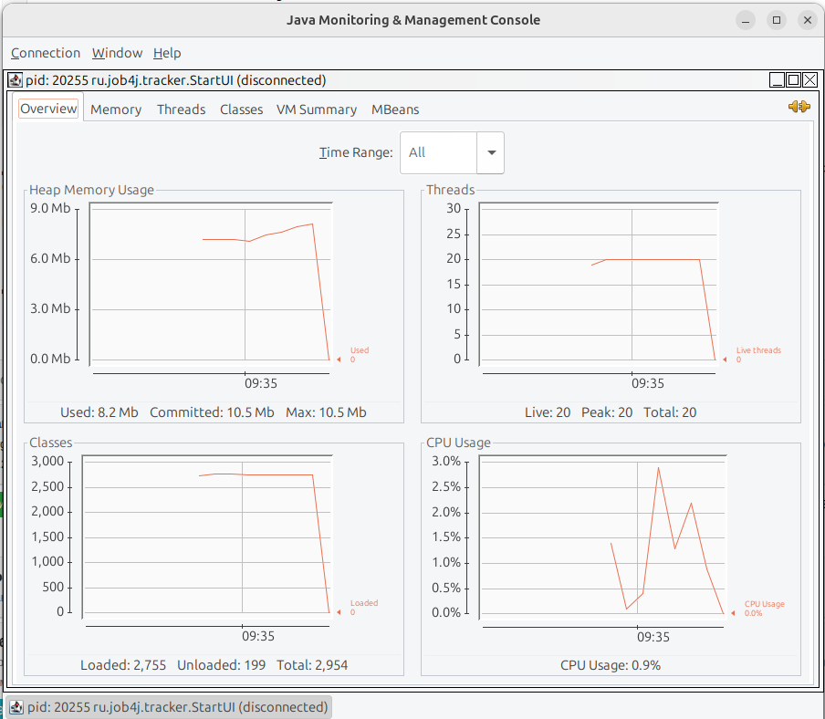

1. Для аналиа утечки памяти использовалась встроенная программа для профилирования jconsole
2. Для получения выхода за пределы памяти был установлен максимальный размер heap в 10 мб.

По прилагаемому скрину заметно, что при достижении максимального размера heap идет остановка приложения и следовательно использования классов, threads и CPU.